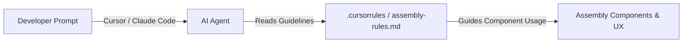

Assembly is engineered to be **AI-native**. In the modern developer loop, code is increasingly generated by AI agents (e.g. Cursor, Claude Code, GitHub Copilot). While these agents are exceptional at writing clean React code, they lack the contextual wisdom of your specific design system's **UX and UI design rules** (like button cases, modal vs sheet behaviors, and color tokens).

To bridge this gap, Assembly bundles an automatic **AI Agent Ruleset Generator** directly into our developer CLI. This writes machine-optimized rule instructions that agents read instantly when executing tasks in your workspace.

---

## The AI Developer Loop

By providing a structured ruleset in your root directory, you give any AI agent direct instruction on how to build using Assembly components:



---

## Setting Up AI Agent Guidelines

You can set up AI rules in your project in two ways:

### Method 1: Interactive Initialization
When running the standard initialization wizard in a fresh Next.js project:
```bash
npx @assembly/cli init
```
The CLI will prompt:
`Would you like to generate AI Agent Rules (.cursorrules) to guide coding agents?`
Confirm with **Yes (Y)** to automatically generate the rules at the root.

### Method 2: Dedicated AI Command
If you have already initialized Assembly and want to generate or update the AI guidelines ruleset, run:
```bash
npx @assembly/cli ai
```
This will read your `assembly.config.json` and generate/regenerate:
1. **`.cursorrules`** (at root): Read automatically by Cursor and Copilot.
2. **`.assembly/assembly-rules.md`** (at root): A shareable markdown instruction manual that can be fed directly to Claude Code, custom GPTs, or other agents.

---

## What the Rules Instruct the Agent

The generated ruleset is structured to prevent common AI styling and design hallucinations. When the rules are loaded, the AI agent is instructed to adhere to:

### 1. Tailwind CSS v4 Color Tokens
Agents are explicitly forbidden from using arbitrary color classes (e.g., `bg-red-500` or `text-gray-900`). Instead, they must use semantic HSL tokens:
* Primary backgrounds: `bg-background`, `bg-card`
* Action states: `bg-primary`, `bg-accent`
* Destructive/Alert: `bg-destructive`, `text-destructive-foreground`
* Borders: `border-border`

### 2. Copywriting Voice & Cases (UX)
* **Sentence Case:** Form labels, button text, and headings must use sentence-case (e.g., "Table name", "Create new database") rather than Title Case.
* **Present-Tense Action Verbs:** Interactive buttons must use specific, direct verbs (e.g., "Enable RLS", "Revoke key") instead of vague nouns ("Submit", "Configure").
* **Constructive Errors:** Error messages must state what went wrong and how to fix it in two simple sentences, avoiding apologies ("Oops!").

### 3. Dialogs vs. Sheets Choice
* **Sheet (Side Drawer):** Must be selected for dense forms, detailed views, and row editors.
* **Dialog / Alert Dialog:** Selected only for short, focused confirmations or destructive actions.
* **Dirty Dismissal Guard:** The agent is instructed to check if a form has unsaved changes (`isDirty`) and always render a confirmation dialog (`DiscardChangesConfirmationDialog`) if the user attempts to dismiss it.

### 4. Table Alignment UX
* **Left-align** text columns.
* **Right-align** numeric, date, and status badge columns.
* **Right-align** row action button groups.

---

## Pairing with Coding Tools

### Cursor
Cursor automatically loads the `.cursorrules` file at the root. Any prompt in Cursor's Composer or Chat (Cmd+K / Cmd+L) will automatically inherit the Assembly guidelines.

### Claude Code
Instruct Claude to load the rules file from `.assembly/assembly-rules.md` at the start of your terminal session, or place a reference in your `.claudecoderc`:
```bash
# Example prompting Claude Code
/load .assembly/assembly-rules.md
```

### GitHub Copilot
Copilot reads instructions in `.github/copilot-instructions.md`. Simply copy the contents of the generated `.cursorrules` to that file.
